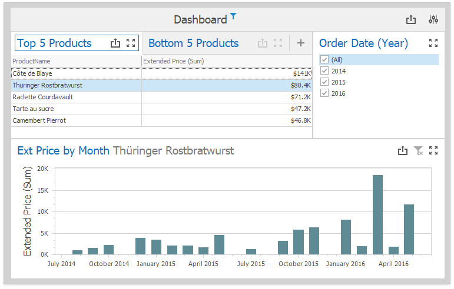

<!-- default badges list -->

<!-- default badges end -->
<!-- default file list -->
*Files to look at*:

* [Form1.cs](./CS/CustomInteractivityExample/Form1.cs)
<!-- default file list end -->

# Dashboard for WinForms - How to use dashboard items in tab pages as independent Master Filters

This example demonstrates how to implement a custom visual interactivity that enables the [Grid](https://docs.devexpress.com/Dashboard/15150) dashboard items placed in different tab pages to act as independent master filters.

The example uses the following API:

* The [DashboardDesigner.DashboardItemSelectionChanged](https://docs.devexpress.com/Dashboard/DevExpress.DashboardWin.DashboardDesigner.DashboardItemSelectionChanged) event is handled to assign selected values to a [dashboard's parameter](https://docs.devexpress.com/Dashboard/16135) and save them in a variable.

* The [DashboardDesigner.DashboardItemVisualInteractivity](https://docs.devexpress.com/Dashboard/DevExpress.DashboardWin.DashboardDesigner.DashboardItemVisualInteractivity) event is handled to restore the selected values and highlight a grid row.

* The [DashboardDesigner.CustomizeDashboardItemCaption](https://docs.devexpress.com/Dashboard/DevExpress.DashboardWin.DashboardDesigner.CustomizeDashboardItemCaption) event displays the filter value in the [Chart](https://docs.devexpress.com/Dashboard/14719) item's [caption](https://docs.devexpress.com/Dashboard/15620).

* The [DashboardDesigner.ConfigureDataConnection](https://docs.devexpress.com/Dashboard/DevExpress.DashboardWin.DashboardDesigner.ConfigureDataConnection) event specifies the [Extract Data Source](https://docs.devexpress.com/Dashboard/115900) file location at runtime.

## Documentation

- [Drill-Down](https://docs.devexpress.com/Dashboard/116913)
- [Master Filtering](https://docs.devexpress.com/Dashboard/116912)
- [Interactivity](https://docs.devexpress.com/Dashboard/116692)
- [Tab Container](https://docs.devexpress.com/Dashboard/400237)

## More Examples 

- [Dashboard for WinForms - How to Initialize Master Filters in Dashboard Viewer](https://github.com/DevExpress-Examples/how-to-apply-default-filtering-to-master-filters-in-dashboardviewer-t329583)
- [Dashboard for WinForms - How to Set Master Filter in Dashboard Viewer](https://github.com/DevExpress-Examples/how-to-apply-master-filtering-in-dashboardviewer-e5097)
